### Intro

本文中，我尝试介绍和使用项目 [Weaponized VSCode](https://github.com/Esonhugh/WeaponizedVSCode)。该项目起源于 exegol 项目中的历史命令补全与环境变量设计，并且随着周围我认识的 hackthebox player 渐渐开始使用环境变量，并且作为渗透测试的基本流程。我认为这种趋势终会推广开来，感染越来越多的渗透测试人员，靶场爱好者等等。

在没有这个 idea 之前，我的项目笔记经历了从 cherry tree （对，这是受到了早期的 OSCP 课程的部分影响）到 markdown 和 Obsidian 的转换。我渐渐开始使用双链笔记并且接受这样一个模式。

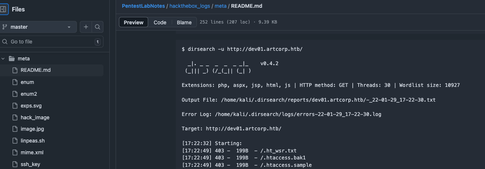

这大约是三年前的笔记了。

我之前一直苦恼于以下几点

例如。笔记中记录的需要使用的命令有些具有时效性，例如 时间参数、反连 shell 的 IP 和端口，这些常常会影响到木马的生成和 shell 的重新获取。例如 Hackthebox VPN 重新生成 VPN 或切换可用区，我们反连的 ip 和端口都会受到影响。

而且，一些长时间的命令，例如监听端口，扫描等等任务，较为机械，但是恢复起来又比较麻烦。例如，机器打了一半被重置了的事情时有发生，这时候如何快速启动和恢复这些任务其实又成了一种难题。

此外，我还希望我的项目和项目之间进行分离，例如靶机的做靶机，工作的做工作，学习的做学习。分开每个环境中需要的，命令、依赖、脚本、历史等等。一个 shell 终端同时用于三个项目，我想这绝对是地狱级别的相互干扰。

Okay，于是在受到了 Exegol 项目的启发后，我开始尝试针对 VSCode 这一 IDE 进行各种自定义配置和魔改。在经历，各个版本的尝试之后，我发布了 Weaponized VSCode 1.0 版本，
### 核心设计理念

我认为，我的项目主要有这么大核心设计理念，也是针对性上面提出的问题进行针对性处理的。

1. 环境变量设计。环境变量设计，主要目的是免除每次相同命令的重复输入。更好支持，通类型命令，但是不同实际参数的命令
2. 笔记所见即所得。在笔记中的命令、变量和值，可以轻松的在 VSCode 各类环境中获取。当你完成笔记编写的同时，你也完成了环境的编写。例如，同一个 password 或 hash 只需要写入笔记一次，就可以在 VSCode 各个功能中获取，比如说 tasks 和 terminal 中获取
3. 独立化项目。尽可能的减少对环境的依赖，可以做到每个项目都相互独立。例如，两个项目都可以拥有一个叫做 PASSWORD 的环境变量，但是它们的值可以不同，也不会相互串扰。
4. 快速恢复。打开了笔记就等于打开了当时渗透测试的环境，可以恢复到当时渗透测试的状态，例如，打开笔记就可以恢复到当时的任务列表、环境变量、脚本、命令等等。在项目切换的情况下，也可以快速进入渗透测试的最佳状态。

### 安装与初始化

0.4.X 的版本后，我更新了 installer 脚本和安装包。下载 release 中的 zip 包后，解压，使用 installer.sh 进行一键安装。

> 如果你需要手动安装，那么可以直接检查 installer.sh。复制  createhackenv 和 zsh_history 两个文件到你的  `~/.local/weapon` 目录下，并且将 `source ~/.local/weapon/createhackenv.sh` 这一行添加到 `~/zshrc` 中。

如果需要体验完全的功能，主要需要多安装 
- vim 
- vscode 
- zsh 
- metasploit 
- project-discovery 的 simplehttpserver 
- 处理 yaml 的 yq 

此外还推荐安装 recommended 的插件，这个在 vscode 插件市场中搜索 @recommended 即可。比较重要的是 foam 插件，这个会影响到你使用双链笔记功能和 foam template 的笔记模版生成。

> 这些软件在 kali linux 中都广泛存在，例如默认有 msf zsh 等
> 
> 当然，如果你是 macos 用户，和我一样，我会推荐你使用 [orbstack](https://orbstack.dev/) ，并且我额外为 orbstack 编写了初始化脚本
### 使用

#### Create Project

开始的方式非常简单，只需要挑选一个你喜欢的目录里，例如我的就是 workspace/hackthebox 目录下，执行以下命令即可

```bash
weapon_vscode ${project}
```

project 可以换成你喜欢的项目名称，例如 xxx.htb 等等。于是我就会帮你初始化出一个项目目录 xxx.htb ，然后自动调用 code 命令打开这个项目。

> 下面会使用 `${PROJECT_FOLDER}` 来代替你实际的项目目录的路径，也是项目整体的根目录。这个也是一个环境变量，可以在 VSCode 的 terminal 中使用，会被自动赋值为 vscode 的 `${workspaceFolder}` 其他的一些环境变量名称也很有用，我会在下面 环境变量的章节重点介绍。

那么对 hackthebox 或者任何渗透项目而言，一开始我们都会有一个 IP 或者域名和目标一些最最基本的信息。那么第一步通常而言就是，使用 VSCode Command Palette 打开命令面板。（通常而言是快捷键 `Ctrl + Shift + P` 或者 `Cmd + Shift + P`） ，然后搜索 `Foam: Create New Note From Template` 。
#### FOAM double link note and templates

这里就是 Weaponized VSCode 的第一个设计，根据 FOAM 模版创建笔记，他会根据 `${PROJECT_FOLDER}/.foam/templates` 下的 markdown 模版文件，生成一个新的笔记。这个模版文件可以是任意的 markdown 文件。

> Foam 是一个基于 markdown 的双链笔记系统，支持 VSCode 编辑器。它允许用户创建和链接笔记，并且可以通过模版来快速生成新的笔记。
> 
> 此外，你可以在 `${PROJECT_FOLDER}/.foam/templates` 目录下添加更多的模版文件，以便于创建不同类型的笔记。包括但不限于 Cluster 之类的模版。

当你最后完成了笔记的编写，那你同时也完成了渗透测试的过程，而最后你可能会想要查看你所有的攻击路径，你只需要使用 VSCode Command Palette， 打开命令面板。（通常而言是快捷键 `Ctrl + Shift + P` 或者 `Cmd + Shift + P`） ，然后搜索 `Foam: Show graph` 。

Boom！你就会看到一个非常漂亮的双链笔记图谱，展示了你所有的笔记和它们之间的链接关系。

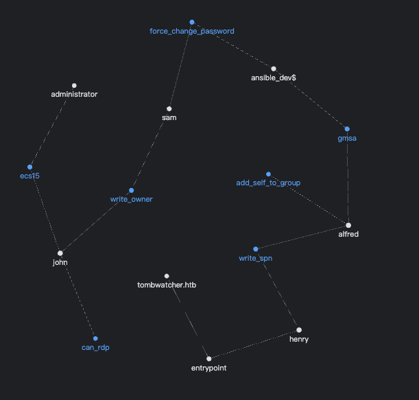

Foam 有一些自己的技巧，例如你可以使用 tags 来通过 tag 链接多个笔记，使用 \[\[ note \]\] 来链接其他笔记，甚至是使用 type 来说明这个笔记所具有类型，例如这是个 user type 的笔记，说明这是一个用户。type 并不会展示在 graph 中，但是 tags 会以链接的形式来链接每一个笔记，你可以完全不链接其他笔记，然后单纯使用 tags 来进行链接。

#### Host Template and its environment variables

一开始，我们在渗透过程中通常会有一个目标主机的 IP 或者域名，那么我们可以创建一个名为 `hostname.md` 的笔记。

当你选择 Host 时，则会自动使用 Host 模版创建一个 `${PROJECT_FOLDER}/hosts/${HOST}/${HOST}.md`文件，`${HOST}` 为你填写的标题。 

你可能很快会注意到一个奇怪的地方，

~~~markdown
```yaml host
- hostname: hostname
  is_dc: false
  ip: 10.10.10.10
  alias: ["hostname"] # if is DC, please set the dc hostname as the first alias, such as ["dc01.example.com"]
```

```zsh env-invoked
set_current_host hostname
```
~~~

> 如果不需要自动设置当前主机，可以将 set_current_host 行其进行注释

这里两个部分会被 yq 自动识别出 yaml 和 zsh 代码块，如果这时候你打开终端，则会发现，

```
Current Host: hostname => hostname (10.10.10.10)  
No current user set.
```

诶，这不正是在 yaml 中设置的 hostname 和 ip 么。

可以在以下 shell 环境中执行如下几个命令

```bash
# 1. 切换当前主机
$ set_current_host # 这个可以用来查看 host 列表或者切换当前主机
current host is set to hostname
Usage: set_current_host <hostname>
Example: set_current_host dc01
supported hosts: 

- hostname: hostname 

# 2. 查看当前主机状态
$ current_status # 查看当前主机和用户是哪个
Current Host: hostname => hostname (10.10.10.10)  
No current user set.

# 3. 列出所有主机
# 自动 dump 出所有符合 /etc/hosts 的主机信息 (alias 也会被创建，这里由于 第一个 alias 是 hostname 所以这里会有两个 hostname)
$ dump_hosts 
10.10.10.10 hostname hostname 

# 4. 重新检查笔记中所有的 host 内容，并且更新当前的环境变量
$ update_host_to_env 
```

所见即所得，现在你就可以自由的使用这个特点来自动化注册，切换当前的主机，以及相关的 DC 服务器。

而当，这个 host 恰好是 dc 服务器时，你可以在 yaml 中设置 `is_dc: true`，那么在切换到这个主机时，VSCode 会自动将当前主机设置为 DC_IP 和 DC_HOST ，当然了，千万不要忘记将 dc 的别名设置为 alias 的第一个参数，例如： `alias: ["dc.hostname"]`。这样 VSCode 才能正确处理 DC 相关的环境变量数据。

例如他会变成

```
# current_status
Current Host: hostname => hostname (10.10.10.10) dc.hostname 10.10.10.10
```
#### Zsh Env-Invoked markdown part

再来，说说 zsh env-invoked 这个部分，这个部分会被当作 zsh 命令块，在启动终端的时候自动进行 source。因此，你可以在这里编写命令或者导出环境变量，例如 aws 的靶场中，你需要自动 assume-role 并且拿到对应的环境变量

那么编写完下面这部分的笔记，你就会自动获得生成的环境变量，然后自然的调用 aws cli 命令即可

```zsh env-invoked
export AWS_DATA=$(aws sts assume-role --role-arn arn:aws:iam::123456789012:role/RoleName --role-session-name SessionName --profile XXXX)
export AWS_ACCESS_KEY_ID=$(echo $AWS_DATA | jq -r '.Credentials.AccessKeyId')
export AWS_SECRET_ACCESS_KEY=$(echo $AWS_DATA | jq -r '.Credentials.SecretAccessKey')
export AWS_SESSION_TOKEN=$(echo $AWS_DATA | jq -r '.Credentials.SessionToken')
export AWS_DEFAULT_REGION=us-west-2
```

当然这些都是自动的，如果希望可以更为方便的执行，我也编写了一个 task 来执行用户编辑区选中的命令，以减少重复劳动。
#### User Template

当然现在的一些靶场会主动提供一个初始的用户，或者你攻下了一个用户的账户，那么通常来说你就可以编写出一个 user 类型的笔记。

通过上面的 host 笔记的创建步骤，同样的，我们创建一个 user 的笔记。但是在输入笔记名称的时候，我特别支持了 user@domain 形式的写法，你可以创建出一个包含用户和所属域名的笔记。

例如 esonhugh@github.com 这个用户，便会创建出一个含有如下文本内容的笔记

~~~markdown
#### validated credentials

```yaml credentials
- login: github.com
  user: esonhugh
  password: pass
  nt_hash: fffffffffffffffffffffffffffffffffff
```

```zsh env-invoked
set_current_user esonhugh
```
~~~

> 如果不需要自动设置当前用户，可以将 set_current_user 行进行注释

打开新终端就会看到

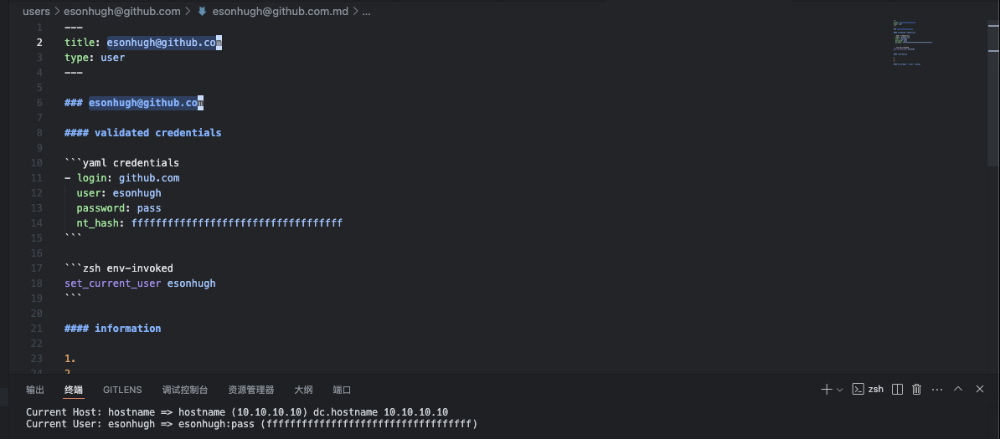

```
Current User: esonhugh => esonhugh:pass (fffffffffffffffffffffffffffffffffff)
```

当然，我也编写了多个辅助命令，来帮助你进行用户凭据的切换和列出，和主机类似。

```bash
# 1. 切换当前用户
$ set_current_user 
current user is set to esonhugh
Usage: set_current_user <A|B|username>
Example: set_current_user A
supported users: 

- esonhugh: esonhugh

# 2. 查看当前用户状态
$ current_status 
Current Host: hostname => hostname (10.10.10.10)  
Current User: esonhugh => esonhugh:pass (fffffffffffffffffffffffffffffffffff)

# 3. 列出所有用户
# 自动 dump 出所有用户，输出格式符合 impacket 的 target 串，并且如果 ntlm 为默认的 fffffffffff... 则会自动忽略 输出为 No NT hash  以及环境变量格式的 export 段落,可以方便的与其他人共享或配合工具联合使用
$ dump_users
dumping impacket format for users:
"github.com"/"esonhugh":'pass' (No NT Hash)

# dumping environment variables for users:
# user: esonhugh
export USER_esonhugh="esonhugh"
export PASS_esonhugh="pass"
export NT_HASH_esonhugh="fffffffffffffffffffffffffffffffffff"
export LOGIN_esonhugh="github.com"

# dumping current user environment variables:
export USER=esonhugh
export USERNAME=pass
export PASS=pass
export PASSWORD=pass
export NT_HASH=fffffffffffffffffffffffffffffffffff
export LOGIN=github.com

export CURRENT_USER=esonhugh
export CURRENT_PASS=pass
export CURRENT_NT_HASH=fffffffffffffffffffffffffffffffffff
export CURRENT_LOGIN=github.com
export CURRENT=esonhugh

# 4. 更新用户凭据到环境变量
$ update_user_cred_to_env
```

#### Core - Environment Variables

在这里，你就会发现环境变量的设计在整个 Weaponized VSCode 中是多么的重要。通过环境变量的设计，你可以轻松的在 VSCode 渗透任务中任何地方使用这些变量。通过查看 
`${PROJECT_FOLDER}/.vscode/env.zsh` 文件，你会发现，很多环境变量都是在这里被定义的。

核心的环境变量，主要分为以下几个大类：

##### Project 文件目录类
- `PROJECT_FOLDER` 这个标识了当前项目的目录。可以帮助你在任何其他目录位置，快速的回到当前项目目录下。例如你有工具的收集习惯，那么你还可以将一些落地的工具 cp 到 当前项目目录文件下。
- 与之相关的还有 `PROJECT_WEB_DELIVERY` 这个默认为 `${PROJECT_FOLDER}/.web_delivery` 的目录，通常用于 HTTP 分发的文件目录，这个设计借鉴了 CobaltStrike 中的 web delivery 的设计。
##### 目标助记类

1. 主机类目标：现在主要通过 host template 中的 yaml 信息进行定义和规范化处理
	- RHOST 和 IP 通常为当前的目标 IP
	- DOMAIN 则是当前的目标域名
	- TARGET 则为目标主机名，如果目标域名为空则默认为 RHOST
	- 如果目标为 DC，则额外会配置如下两个环境变量
		- DC_IP 则为当前的 DC 服务器 IP
		- DC_HOST 则为当前的 DC 服务器主机名
2. 多主机目标：
	- HOST_{hostname} 则会自动引用对应的主机
	- IP_{hostname} 则会自动引用对应主机的 IP
3. 用户类目标：现在主要通过 user template 中的 yaml 信息进行定义和规范化处理
	- USER 和 USERNAME 通常为当前的目标用户名
	- PASS 和 PASSWORD 通常为当前的目标用户密码
	- NT_HASH 则为当前的目标用户的 NTLM hash
	- LOGIN 则为当前的目标用户的登录地址，例如域名
4. 多用户目标： 例如在进行委派或者特权提升操作的时候，你可能会在命令中同时使用到多个用户，例如 `force-resetpassword -u userA -p passA -target userB -target-pass passB`
	- USER_{username} 则会自动引用对应的 user
	- PASS_{username} 则会自动引用对应用户的 password
	- NT_HASH_{username} 则会自动引用对应用户的 NTLM hash
##### 反连助记类

- `LHOST` 或 ATTACKER_IP 这两个变量是当前的反连 IP，通常情况下是你本机的 IP 地址。在 Hackthebox 中，通常是 VPN 的 IP 地址。之所以称之为 LHOST 主要是因为 metasploit 常用该命名来对 payload 进行生成。你也可以将其定义为 VPS 的地址并且在 VPS 上启动 ssh 远程端口转发等等。
- `LPORT` 这个是当前的反连端口，通常情况下是你本机的监听端口，这个变量会影响 msf 监听的端口以及 netcat 监听的端口。
##### Hash 爆破类

1.  HASH Type 类：我将 Hashcat example_hash.html 中的常用 hash 类型进行了整理，并且将其编写为环境变量，例如
	- MD5 的类型称之为 `$HASH_MD5` 其值为 0。
	- SHA1 的类型称之为 `$HASH_SHA1` 其值为 100
	- ...
2. HASHCAT MODE 类：这个 mode 指的是 hashcat 的爆破模式，例如
	- `$HASHCAT_MODE_WORDLIST` 表示使用字典爆破模式，其值为 0
	- `$HASHCAT_MODE_COMBINATION` 表示使用组合爆破模式，其值为 1
	- ...
3. HASHCAT DEVICE 类：这个表示使用的 hashcat 的设备类型，例如
	- `$HASHCAT_DEVICE_CPU` 表示使用 CPU 设备，其值为 1
	- `$HASHCAT_DEVICE_GPU` 表示使用 GPU 设备，其值为 2
	结合下面的字典类变量，你可以几乎语言表达出，hashcat 的命令，例如
	- `hashcat -m $HASH_MD5 -a $HASHCAT_MODE_WORDLIST -d $HASHCAT_DEVICE_GPU --restore ${ROCKYOU} hash.txt` 
##### 字典文件目录类
- `WORDLIST` 这个是机器的默认字典目录，通常情况下 kali 的为 `/usr/share/wordlists`
- `ROCKYOU` 这个是 rockyou 的字典路径，通常情况下为 `${WORDLIST}/rockyou.txt`
- `SECLIST`  则是 seclist 的字典路径，通常情况下为 `${WORDLIST}/seclists`
- `TOP_DNS` 是指向 `${SECLIST}/Discovery/DNS/bitquark-subdomains-top100000.txt` 作为默认子域名爆破字典
##### 虚假时间类
FAKETIME 可以用于修改系统的默认时间等情况
- `export LD_PRELOAD=/usr/local/lib/libfaketime.so.1` 例如通过 LD PRELOAD 注入
- `export FAKETIME="+8h"` 调整 FAKETIME 具体时间，例如这个表示将时间提前 8 小时
#### Auto tasks

在完成了这些设置后，基本的笔记中输入的环境就可以轻易的在终端中获取了。我准备了多种任务来帮助渗透测试的流程继续进行。

使用起来也很简单，唤起 VSCode Command Palette ，打开命令面板。（通常而言是快捷键 `Ctrl + Shift + P` 或者 `Cmd + Shift + P`） ，然后搜索 `Tasks: Run Task`，然后选择你需要的任务即可。

我这里提供了一些很常用的任务，来解放双手，例如

##### Msfvenom payload creating

这个是用于自动化生成 msf payload 的 msfvenom 命令生成工具。在这个任务中，你可以任意选择生成的 payload 类型，例如 `linux/x86/meterpreter/reverse_tcp`，你也可以直接使用 LHOST 配置为当前 IP， LPORT 配置为对应的反连端口，命令行会自动配置出你需要的变量。

甚至你可以自定义选用一些高级的命令用法，
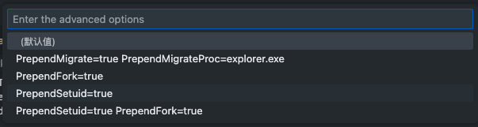

输出的文件默认为 `${PROJECT_FOLDER}/trojan`，你可以在任务中自定义输出文件名。输出的格式也可自定义
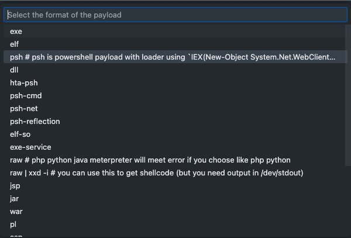

##### Edit /etc/hosts 

这个任务主要是为了方便对 /etc/hosts 进行编辑，而在启动 sudo 的 vim 编辑之前，我会使用 dump_hosts 命令来提示当前需要配置哪些 host 
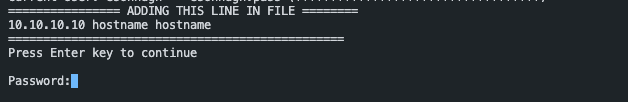

 ##### Service account token kubeconfig generation

用于创建 Kubernetes 的 Service Account Token 的 kubeconfig 文件 会提示用户输入 对应的 k8s apiserver 的 api endpoint 以及服务账户 token 和输出文件位置。

##### Hashcat Runner 

这是一个爆破 HASH 的 hashcat 快速启动任务，主要包括以下几个步骤：
1. 选择 hashcat 模式，默认为字典模式
2. hash 类型，默认为 md5 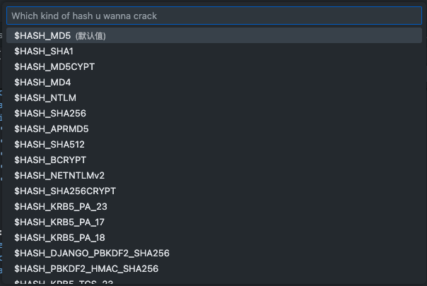
3. 选择设备类型，默认为 GPU
4. 输入 hash 文件名称，默认为 `${file}` 这个是指 vscode 中当前编辑器打开的文件，如果你已经将 hash 拷贝进新文件并且当前编辑器打开的就是这个文件，则直接默认这个即可 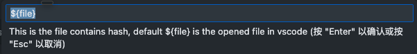
5. 最后输入后续的 string 即可，例如字典即为 ${ROCKYOU} 或者你可以输入自己的掩码，进行爆破。

所有内容都输入完毕后，vscode 便会自动拉起 hashcat 进行爆破，并且该操作会被 vscode 自动守护，你就可以解放自己双手去做更重要的事情了。

##### Auto rustscan

这个任务主要是用于自动化运行 rustscan 命令，主要包括以下几个步骤
1. 选择目标主机，默认为 `${RHOST}` 或者 `${TARGET}` 
2. 输入 nmap 参数，例如 -A --script=vuln 

nmap 的端口范围会被 rustscan 自动扫描出后，重写到 nmap 命令做精细扫描。

##### run command with selection
手动选择笔记中的命令，自动以 task 类型进行执行。是 markdown-execute 插件的下位替代，可以快速重复执行笔记中的命令。

#### 特殊终端

在探索终端功能的时候，或许你已经留意到了，我配置了很多种不同功能的终端，例如：

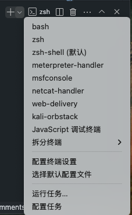

##### ZSH-SHELL
zsh-shell 为默认的 zsh shell 终端，会自动导入笔记中的环境变量。是正常的 zsh 终端。
##### meterpreter-handler
这是一个用于接收 meterpreter 反连 shell 的终端。它会自动导入 RHOST 和 LHOST 环境变量，并且会自动执行 `${PROJECT_FOLDER}/.vscode/metasploit_handler.rc` 中的 RC 文件内容。

该 RC 文件是 Metasploit 的 Resource Script，可以自动设置 payload 类型，并且使用 `run -j` 启动后台任务，而其中的任务则是会启动 一个 meterpreter 的 multi/handler 监听。

RC file 是 msf 的一个特性，实际被叫做 Resource Script https://docs.rapid7.com/metasploit/resource-scripts/

当你使用 vscode task， 完成 payload 创建后，你就可以编辑这个文件，然后启动这个类型的终端，让 msfconsole 同时启动单个或者多个监听任务。
##### msfconsole 
这是一个用于启动 msfconsole 的终端。它会自动导入 RHOST、LHOST 和 LPORT 环境变量，并且会自动执行 `${PROJECT_FOLDER}/.vscode/msfconsole.rc` 中的 RC 文件内容。

这个目的是为了和 meterpreter-handler 进行区分，并且减少启动时间。
##### netcat-handler
这是一个用于接收 netcat 反连 shell 的终端。它会自动导入 LHOST 环境变量，并且监听在 LPORT 环境变量指定的端口上。我在这里配置了 rlwrap 来增强 netcat 的交互体验，可以使得 netcat 也支持上滑获取历史命令的能力。

此外，当你使用 netcat 进行监听的时候，还会贴心的自动帮助你编写出一条基本的反弹 shell 指令，当然你也可以使用高级的 rev.eson.ninja 来自动生成对应的命令，在这个网站中，我修复了 rev sh 的 url 解析失败问题，因此，反连的 IP 和端口可以通过 url 参数进行指定。

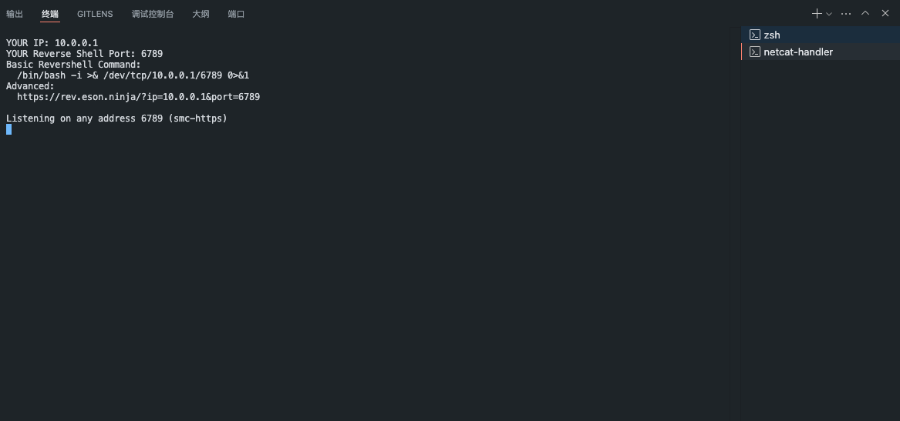
##### web-delivery 模式

上文已经铺垫了很久，本质上说这个就是一个 简单的 http 服务器，但是默认带有 PUT 方法上传文件。

首先，这个终端启动时如果发现没有创建 .web-delivery 则会自动创建，然后将该目录作为 www root 进行托管。

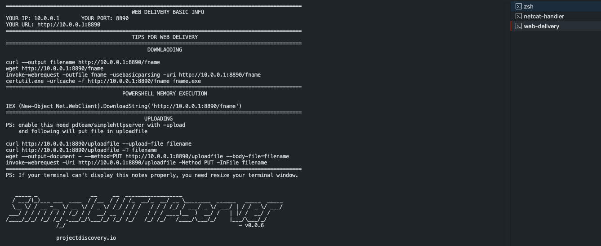

可以看到，当你使用它启动了一个 http 终端后，他会主动告知你 你的 IP 时多少 端口是多少，自动生成对应的命令来应付各种情况。

第一部分是 windows linux 的下载方式，linux 下的 curl 或 wget 以及 windows 下的 certutil 和 powershell invoke-webrequest 。

第二部分是 powershell 一句话，执行远程下载无文件内存执行的方式。

这两部分 python http server 也可以完成。

第三部分则是 simplehttpserver 支持的 PUT 方法上传文件的方式。支持使用 curl 或者 wget 进行上传，也支持使用 invoke-webrequest 进行上传。

如果你细心一点，你会发现，我将所有需要填写的文件名参数都尽量留在了命令的末尾，以方便诸位在命令行终端中快速进行文件名的修改和替换。


