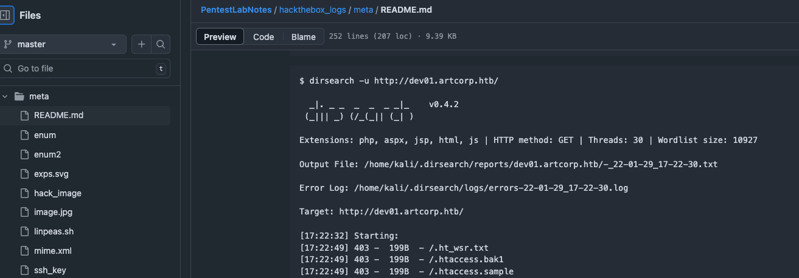
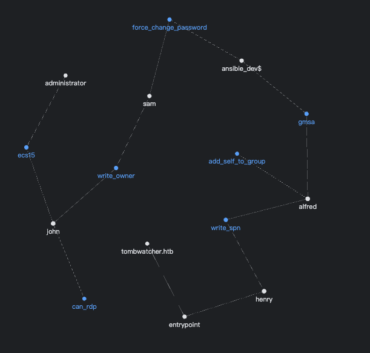
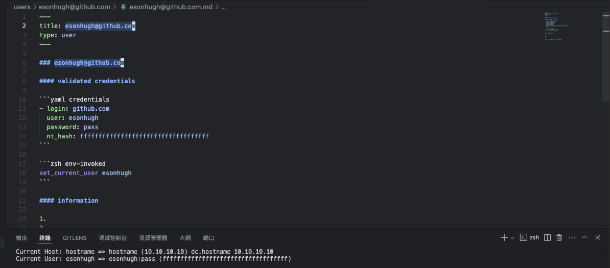
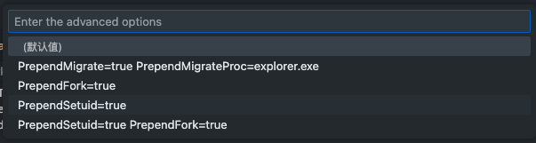
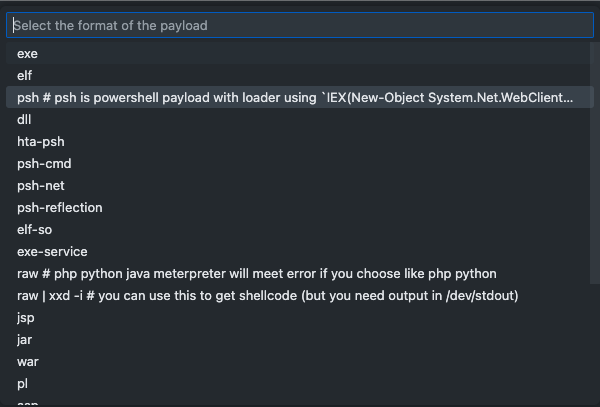
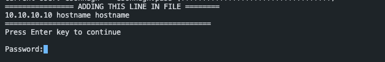
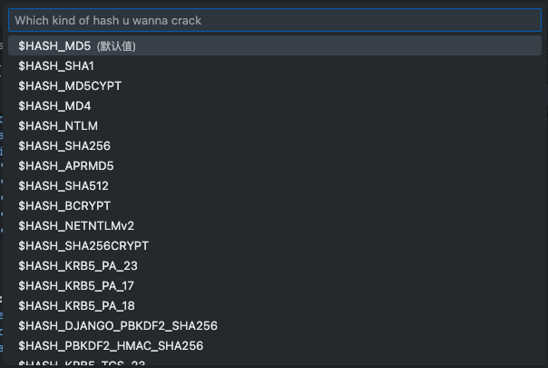

### Intro  
In this article, I'm trying to introduce and use the project [Weaponized VSCode](https://github.com/Esonhugh/WeaponizedVSCode). The project originated from the historical command completion and environment variable design in the exegol project, and gradually started to use environment variables as a basic process for penetration testing as the hackthebox player I knew around me. I think this trend will eventually spread, infecting more and more penetration testers, range enthusiasts, and so on.

Before this idea, my project notes went through a transition from cherry tree (yes, this was partly influenced by the earlier OSCP lessons) to markdown and obsidian. I gradually started using double-stranded notes and embraced this pattern.



This was a note from about three years ago.

 I've been struggling with the following issues:

For example. Some of the commands recorded in the notes are time-sensitive, such as time parameters, the IP and port of the reconnected shell, which often affect the generation of Trojans and the retrieval of shells. For example, if Hackthebox VPN regenerates the VPN or switches Availability Zones, the IPs and ports we are reconnecting to will be affected.

Also, some long-term commands, such as listening on ports, scanning, and so on, are more mechanical, but they are more cumbersome to restore. For example, when a machine is reset in half, it becomes a challenge to quickly start and resume these tasks.

In addition, I also want to separate my projects from projects, such as the target machine doing the target machine, the work doing the work, and the learning doing the study. Separate what is needed in each environment, commands, dependencies, scripts, history, and so on. One shell terminal for three projects at the same time, which I guess is absolutely hellish level of mutual interference.

Okay, so after being inspired by the Exegol project, I started experimenting with all sorts of custom configurations and magic changes to the VSCode IDE. After going through and trying various versions, I released version 1.0 of Weaponized VSCode.

### Core design concept

In my opinion, my project mainly has such a large core design concept, and it is also targeted to deal with the problems raised above.

1. Environment variable design. Environment variables are designed to eliminate the need for repeated input of the same command each time. Better support for commands that pass types, but commands with different actual parameters
2. What you see is what you get. The commands, variables, and values in the notes can be easily retrieved in a variety of VSCode environments. When you're done writing your notes, you're also writing your environment. For example, the same password or hash only needs to be written once to the note, and it can be retrieved in various features of VSCode, such as tasks and terminals
3. Independence project. Minimize dependence on the environment, so that each project is independent of each other. FOR EXAMPLE, BOTH PROJECTS CAN HAVE AN ENVIRONMENT VARIABLE CALLED PASSWORD, BUT THEY CAN HAVE DIFFERENT VALUES AND DON'T CROSSTALK WITH EACH OTHER.
4. Rapid recovery. Opening the note is equivalent to opening the penetration test environment at that time, and you can restore the state of the penetration test at that time, for example, opening the note can restore the task list, environment variables, scripts, commands, and so on at that time. In the case of project switching, it is also possible to quickly enter the optimal state of penetration testing.

### Installation and initialization

After version 0.4.X, I updated the installer script and installation package. Once you've downloaded the zip package from the release, unzip it, and use installer.sh for one-click installation.

> If you need to install it manually, you can check the installer.sh directly. Copy the createhackenv and zsh_history files to your `~/.local/weapon` directory and add `source ~/.local/weapon/createhackenv.sh` the line to `~/zshrc`.

  If you need to experience full functionality, you mainly need to install more.
- vim
- vscode
- zsh
- metasploit
- project-discovery  simplehttpserver
- yq for yaml parsing

In addition, it is recommended to install the recommended plugin, which can be searched for @recommended in the VSCode plugin market. The most important thing is the foam plugin, which affects the generation of note templates using the double-chain note feature and the foam template.

> These software are all widely available in Kali Linux, such as MSF ZSH by default
> 
> Of course, if you're a macOS user, like me, I'd recommend using [OrbStack](https://orbstack.dev/), and I've written an additional initialization script for OrbStack

### Usage

The way to get started is very simple, just pick a directory you like, for example, mine is in the workspace/hackthebox directory, and execute the following command

```bash
weapon_vscode ${project}
```

Project can be swapped out with your preferred project name, e.g. xxx.htb, and so on. So I'll help you initialize a project directory xxx.htb, and then automatically call the code command to open the project.

> Instead of the path to your actual project directory, which is the root directory of the project as a whole, $`{PROJECT_FOLDER}` will be used below. This is also an environment variable that can be used in the VSCode terminal and is automatically assigned to $`{workspaceFolder}` for vscode Some other environment variable names are also useful, which I'll focus on in the Environment Variables section below.

So for hackthebox or any pentesting project, we start with an IP or domain name and some basic information about the target. The first step is usually to open the command palette using VSCode Command Palette. (Usually the shortcut `Ctrl + Shift + P` or `Cmd + Shift + P`) and search for `Foam: Create New Note From Template` .

#### FOAM double link note and templates

This is the first design of Weaponized VSCode, which creates a note from the FOAM template, and he will generate a new note based on the markdown template file `${PROJECT_FOLDER}/.foam/templates` under . This template file can be any markdown file.

> Foam is a markdown-based, dual-chain note-taking system that supports the VSCode editor. It allows users to create and link notes, and new notes can be quickly generated through templates.
>
> In addition, you can add more template files to the `${PROJECT_FOLDER}/.foam/templates` directory to make it easier to create different types of notes. This includes, but is not limited to, templates such as Cluster.

When you're done writing your notes, you're also done with the penetration testing process, and at the end you might want to see all your attack paths, just use VSCode Command Palette to open the command palette. (Usually `Ctrl + Shift + P` or `Cmd + Shift + P`) and search for `Foam: Show graph`.

Boom！ You'll see a very nice double-stranded note graph that shows all your notes and the links between them.



Foam has some tricks of its own, such as using tags to link multiple notes by tag, [[ note ]] to link other notes, or even using type to indicate the type of note it has, e.g. if this is a user type note, this is a user. The type doesn't show up in the graph, but tags will link each note as a link, and you can use tags to link to each note at all.

#### Host Template and its environment variables

In the beginning, we usually have an IP or domain name of the target host during the infiltration process, so we can create a note called `hostname.md`.

When you select Host, a `${PROJECT_FOLDER}/hosts/${HOST}/${HOST}.md` file is automatically created using the Host template, with `${HOST}` as your title.

 You may soon notice a strange place,

````markdown
```yaml host
- hostname: hostname
  is_dc: false
  ip: 10.10.10.10
  alias: ["hostname"] # if is DC, please set the dc hostname as the first alias, such as ["dc01.example.com"]
```

```zsh env-invoked
set_current_host hostname
```
````

>  If you don't need to set the current host automatically, you can annotate it with set_current_host
  
Here the two parts will be automatically recognized by yq yaml and zsh code blocks, if you open the terminal at this time, you will find that

```
Current Host: hostname => hostname (10.10.10.10)  
No current user set.
```
  
Eh, isn't that exactly the hostname and IP set in YAML?

The following commands can be executed in the following shell environment

```zsh
# 1. switch host
$ set_current_host
current host is set to hostname
Usage: set_current_host <hostname>
Example: set_current_host dc01
supported hosts: 

- hostname: hostname 

# 2. lookup current host and user
$ current_status 
Current Host: hostname => hostname (10.10.10.10)  
No current user set.

# 3. list all hosts and dump with /etc/hosts format
$ dump_hosts 
10.10.10.10 hostname hostname 

# 4. resync all hosts notes and update ennvironment variables
$ update_host_to_env
```
What you see is what you get, and now you are free to use this feature to automate registration, switch the current host, and the associated DC server.

And when this host happens to be a dc server, you can set `is_dc: true` in yaml, then when switching to this host, VSCode will automatically set the current host to DC_IP and DC_HOST, and of course, don't forget to set the alias of dc to the first parameter of alias, for example: `alias: ["dc.hostname"].` This allows VSCode to properly handle DC-related environment variable data.

For example, he will become

```
# current_status
Current Host: hostname => hostname (10.10.10.10) dc.hostname 10.10.10.10
```

#### Zsh Env-Invoked markdown part

Next, let's talk about the zsh env-invoked part, which will be used as a zsh command block and will automatically source when the terminal is started. Therefore, you can write a command or export environment variables here, for example, in the AWS range, you need to automatically assume-role and get the corresponding environment variables

After writing the following part of the note, you will automatically get the generated environment variables, and then naturally call the AWS CLI command

```zsh
export AWS_DATA=$(aws sts assume-role --role-arn arn:aws:iam::123456789012:role/RoleName --role-session-name SessionName --profile XXXX)
export AWS_ACCESS_KEY_ID=$(echo $AWS_DATA | jq -r '.Credentials.AccessKeyId')
export AWS_SECRET_ACCESS_KEY=$(echo $AWS_DATA | jq -r '.Credentials.SecretAccessKey')
export AWS_SESSION_TOKEN=$(echo $AWS_DATA | jq -r '.Credentials.SessionToken')
export AWS_DEFAULT_REGION=us-west-2
```

Of course, these are automatic, and if I want to make it easier to execute, I have also written a task to execute the commands selected in the user's edit area to reduce duplication of effort.

#### User Template
 
Of course, some ranges nowadays will offer an initial user, or if you take down a user's account, then you can usually write a user-type note.

Using the above steps to create the host note, we will create a user note as well. However, when entering the name of the note, I especially support the user@domain format, so you can create a note with the user and the domain name it belongs to.

For example, [esonhugh@github.com](mailto:esonhugh@github.com) will create a note with the following text

````markdown
#### validated credentials

```yaml credentials
- login: github.com
  user: esonhugh
  password: pass
  nt_hash: fffffffffffffffffffffffffffffffffff
```

```zsh env-invoked
set_current_user esonhugh
```
````

> If you don't need to set the current user automatically, you can comment it with set_current_user

Open a new terminal and you'll see it



```
Current User: esonhugh => esonhugh:pass (fffffffffffffffffffffffffffffffffff)
```

Of course, I've also written a number of secondary commands to help you switch and list user credentials, similar to hosts.

```bash
# 1. switch user
$ set_current_user 
current user is set to esonhugh
Usage: set_current_user <A|B|username>
Example: set_current_user A
supported users: 

- esonhugh: esonhugh

# 2. lookup current host and user
$ current_status 
Current Host: hostname => hostname (10.10.10.10)  
Current User: esonhugh => esonhugh:pass (fffffffffffffffffffffffffffffffffff)

# 3. list all users and dump with impacket format and environment variables export format
$ dump_users
dumping impacket format for users:
"github.com"/"esonhugh":'pass' (No NT Hash)

# dumping environment variables for users:
# user: esonhugh
export USER_esonhugh="esonhugh"
export PASS_esonhugh="pass"
export NT_HASH_esonhugh="fffffffffffffffffffffffffffffffffff"
export LOGIN_esonhugh="github.com"

# dumping current user environment variables:
export USER=esonhugh
export USERNAME=pass
export PASS=pass
export PASSWORD=pass
export NT_HASH=fffffffffffffffffffffffffffffffffff
export LOGIN=github.com

export CURRENT_USER=esonhugh
export CURRENT_PASS=pass
export CURRENT_NT_HASH=fffffffffffffffffffffffffffffffffff
export CURRENT_LOGIN=github.com
export CURRENT=esonhugh

# 4. resync all users notes and update environment variables
$ update_user_cred_to_env
```

#### Core - Environment Variables

Here, you'll see how important the design of environment variables is in Weaponized VSCode as a whole. With the design of environment variables, you can easily use them anywhere in your VSCode infiltration task. By viewing `${PROJECT_FOLDER}/.vscode/env.zsh` file, you'll notice that a lot of the environment variables are defined here.

 The core environment variables are divided into the following categories:

##### Project file directory class

- `PROJECT_FOLDER` This is the directory that identifies the current project. It can help you quickly return to the current project directory in any other directory location. For example, if you have a habit of collecting tools, then you can also cp some landed tools to the current project directory file.
- Related to this is `the default` directory `${PROJECT_FOLDER}/.web_delivery` of PROJECT_WEB_DELIVERY, which is typically used for HTTP distribution, and is a design borrowed from the design of web delivery in CobaltStrike.

#####  Target mnemonics

1. Host class targets: They are now defined and normalized primarily through yaml information in the host template
    - The RHOST and IP are usually the current destination IPs
    -  DOMAIN is the current target domain name
    - TARGET IS THE TARGET HOSTNAME, OR RHOST IF THE TARGET DOMAIN NAME IS EMPTY
    -  If the target is DC, the following two environment variables are configured
        - DC_IP is the current DC server IP
        - DC_HOST is the current DC server hostname
2. Multi-host targeting:
    - HOST_{hostname} automatically references the corresponding host
    - IP_{hostname} will automatically reference the IP of the corresponding host
2. User class targets: They are now defined and normalized primarily through YAML information in the user template
    - USER AND USERNAME ARE USUALLY THE CURRENT TARGET USERNAMES
    - PASS and PASSWORD are usually the current target user passwords
    - NT_HASH is the NTLM hash of the current target user
    - LOGIN IS THE LOGIN ADDRESS OF THE CURRENT TARGET USER, SUCH AS A DOMAIN NAME
3. Multi-user targeting: For example, when performing a delegation or privilege escalation operation, you may use multiple users at the same time in a command, such as `force-resetpassword -u userA -p passA -target userB -target-pass passB`
    - USER_{username} will automatically reference the corresponding user
    - PASS_{username} will automatically reference the user's password
    - NT_HASH_{username} will automatically reference the corresponding user's NTLM hash

##### Reverse connection mnemonic

- `LHOST` or ATTACKER_IP are the current disconnect IPs, which are usually your local IP addresses. In Hackthebox, it's usually the VPN's IP address. The main reason why it is called LHOST is that metasploit often uses this name to generate payloads. You can also define it as the address of the VPS and initiate ssh remote port forwarding on the VPS, etc.
- `LPORT` This is the current unconnection port, usually your local listening port, this variable affects the port that msf listens on and the port that netcat listens on.

#####   Hash cracking

1. HASH Type class: I've cleaned up the common hash types in the Hashcat example_hash.html and written them as environment variables, for example
    - The type of MD5 is called `$HASH_MD5` and has a value of 0.
    - The type of SHA1 is called `$HASH_SHA1` and its value is 100
    - ...
2. HASHCAT MODE class: This mode refers to the brute-force mode of the hashcat, for example
    - `$HASHCAT_MODE_WORDLIST` indicates the use of dictionary brute-force mode, which has a value of 0
    - `$HASHCAT_MODE_COMBINATION` indicates that a combined brute-force mode is used, and its value is 1
    - ...
3. HASHCAT DEVICE class: This represents the type of device used for hashcat, for example
    - `$HASHCAT_DEVICE_CPU` indicates the use of a CPU device with a value of 1
    - `$HASHCAT_DEVICE_GPU` represents a device that uses GPU and has a value of 2  
        Combined with the following dictionary class variables, you can almost verbally express the hashcat command, for example
    - `hashcat -m $HASH_MD5 -a $HASHCAT_MODE_WORDLIST -d $HASHCAT_DEVICE_GPU --restore ${ROCKYOU} hash.txt`

##### Dictionary file directory class

- `WORDLIST` is the default dictionary directory of the machine, usually /`usr/share/wordlists`
- `ROCKYOU` is the dictionary path of rockyou, usually `${WORDLIST}/rockyou.txt`
- `SECLIST` is the dictionary path to seclist, usually `${WORDLIST}/seclists`
- `TOP_DNS` is a brute-force dictionary `${SECLIST}/Discovery/DNS/bitquark-subdomains-top100000.txt` that points to as the default subdomain

##### 虚假时间类  False time class

FAKETIME CAN BE USED TO MODIFY THE DEFAULT TIME OF THE SYSTEM, ETC

- `export LD_PRELOAD=/usr/local/lib/libfaketime.so.1` FOR EXAMPLE, INJECT VIA LD PRELOAD
- `export FAKETIME="+8h"` to adjust the FAKETIME time, e.g. this means that the time will be advanced by 8 hours

#### Auto tasks

Once these settings are complete, the environment for basic notes can be easily accessed in the terminal. I have prepared a variety of tasks to help the penetration testing process continue.

it's also very simple to use, evoking VSCode Command Palette and opening the command palette. (usually `Ctrl + Shift + P` or `Cmd + Shift + P`) and search for `Tasks: Run Task`, then select the task you want.

 I've provided some of the most commonly used tasks to free your hands, such as:

##### Msfvenom payload creating

This is the msfvenom command generation tool used to automate the generation of msf payload. In this task, you can choose the type of payload to be generated, for example `linux/x86/meterpreter/reverse_tcp` , you can directly use LHOST to configure the current IP and LPORT to the corresponding reconnection port, and the command line will automatically configure the variables you need.

You can even customize some advanced command usage,



The output file defaults to `${PROJECT_FOLDER}/trojan`, and you can customize the output file name in the task. The format of the output is also customizable



##### Edit /etc/hosts

This task is mainly to facilitate the editing of /etc/hosts, and before initiating vim editing of sudo, I will use the dump_hosts command to indicate which hosts need to be configured



##### Service account token kubeconfig generation

The kubeconfig file used to create the Kubernetes Service Account Token prompts the user to enter the API endpoint of the corresponding k8s apiserver, as well as the service account token and output file location.

##### Hashcat Runner
  
This is a hashcat quick start task that brute forces HASH, which mainly includes the following steps:

1. Select hashcat mode, which defaults to dictionary mode
2. hash type, default is md5 
3. Select the device type, which defaults to GPU
4. Enter the hash file name, default is `${file}` This refers to the file opened by the current editor in vscode, if you have copied the hash into a new file and the current editor opens this file, then you can directly default to this 
5. Finally, you can enter the subsequent string, e.g. `${ROCKYOU}` for the dictionary or you can enter your own mask to bruteforce
Once everything is typed, vscode will automatically pull up the hashcat to brute force, and the operation will be automatically guarded by vscode, so you can free your hands to do more important things.

##### Auto rustscan

This task is mainly used to automate the running of rustscan commands, and mainly includes the following steps

1. Select the target host, which is `${RHOST}` or `${TARGET}` by default
2. Enter the nmap parameter, e.g. -A --script=vuln
  
The port range of nmap will be automatically scanned by rustscan, and then rewritten to the nmap command for fine scanning.

##### run command with selection

Manually select a command in a note to automatically execute it as a task type. It is a subordinate alternative to the markdown-execute plugin, which allows you to quickly and repeatedly execute commands in notes.

#### Special terminals
  
As you may have noticed when exploring terminal features, I have configured a terminal with many different functions, such as:


##### ZSH-SHELL

zsh-shell 为默认的 zsh shell 终端，会自动导入笔记中的环境变量。是正常的 zsh 终端。  
zsh-shell is the default zsh shell terminal, which automatically imports environment variables in notes. is a normal zsh terminal.
##### meterpreter-handler
 
The RC file is Metasploit's Resource Script, which automatically sets the payload type and uses `run -j` to start a background task that starts a multi/handler listener for a meterpreter.

> Resource Script [https://docs.rapid7.com/metasploit/resource-scripts/](https://docs.rapid7.com/metasploit/resource-scripts/)

When you use vscode task, after creating a payload, you can edit the file, and then start this type of terminal, so that msfconsole can start one or more listening tasks at the same time.

##### msfconsole
  
This is a terminal for launching msfconsole. It automatically imports RHOST, LHOST, and LPORT environment variables, and automatically executes `${PROJECT_FOLDER}/.vscode/msfconsole.rc` the RC file content in .

The purpose of this is to distinguish it from the meterpreter-handler and to reduce the startup time.

##### netcat-handler

This is a terminal used to receive the NetCAT anti-disconnect shell. It automatically imports the LHOST environment variable and listens on the port specified by the LPORT environment variable. I've configured rlwrap here to enhance the interactive experience of netcat, so that netcat also supports the ability to swipe up to get historical commands.

In addition, when you use netcat to listen, it will also help you write a basic bounce shell instruction, of course, you can also use the advanced rev.eson.ninja to automatically generate the corresponding command, in this website, I fixed the rev sh url parsing failure problem, therefore, the IP and port of the unconnection can be specified by the url parameter.


##### web-delivery 模式
  
This has been a long time coming, and this is essentially a simple http server, but uploads files with the PUT method by default.

First, if the terminal starts up and finds that it doesn't create a .web-delivery, it will automatically create it, and then host the directory as www root.


As you can see, when you use it to start an http terminal, it will take the initiative to tell you what is your IP and what is the port, and automatically generate corresponding commands to deal with various situations.

The first part is how to download Windows Linux, curl or wget under Linux, and certutil and PowerShell invoke-webrequest under Windows.

The second part is PowerShell in one command, performing a remote download of fileless memory execution.

Both of these two parts of Python HTTP Server can also be done.

The third part is how to upload files using the PUT method supported by simplehttpserver. You can use curl or wget to upload, and you can also use invoke-webrequest to upload.

If you are careful, you will find that I have left all the file name parameters that need to be filled in at the end of the command as much as possible, so that you can quickly modify and replace the file name in the command line terminal.